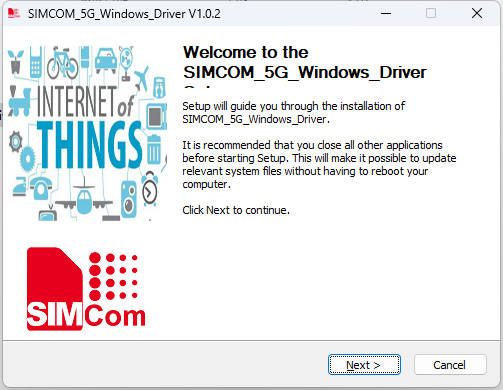
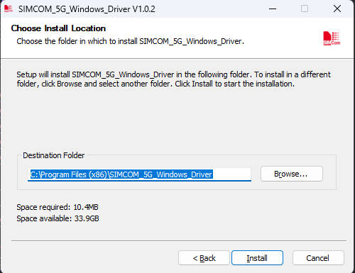
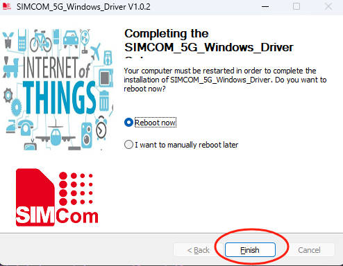

## Quick Step

1. Update the built-in firmware of ESP32S3 to<MinimalModemUpgrade>to ensure that the program is only responsible for enabling SIM7080G
2. Connect the two USB ports of the board, USB-C and Micro-USB, and operate according to the following image

3. Open [SIM7080 Driver](https://github.com/Xinyuan-LilyGO/LilyGo-T-PCIE/tree/master/update_simxxxx_firmware/USB_driver/SIMCOM_Windows_USB_Drivers_V1.0.2.exe)
   
4. There are two ways to add drivers:

    (1)Open the computer device manager and follow the steps below to add the driver. 
    
    
    
    
    

    (2) Open [SIMCOM_Windows_USB_Driver](https://github.com/Xinyuan-LilyGO/LilyGo-T-PCIE/tree/master/update_simxxxx_firmware/USB_driver/SIMCOM_Windows_USB_Drivers_V1.0.2.exe)   

    
    
    

    Follow the above steps to install the driver for the remaining ports that are not installed.
    

5. Download [upgrade_tool](https://github.com/Xinyuan-LilyGO/LilyGo-T-PCIE/tree/master/update_simxxxx_firmware/upgrade_tool/SIM7080_SIM7500_SIM7600_SIM7900_SIM8200%20QDL%20V1.58%20Only%20for%20Update)
6. Open `sim7080_sim7500_sim7600_sim7900_sim8200 qdl v1.58 only for update.exe` 
7.  Open the upgrade tool and follow the diagram below 

    
    
    
    
    
    
    

8. Open the serial terminal tool, or the built-in serial tool of `Arduino IDE`, select `AT Port` for the port, and enter `AT+CGMR` to view the firmware version 
    

